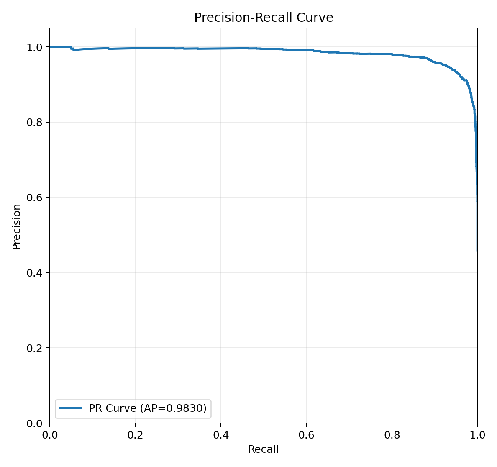
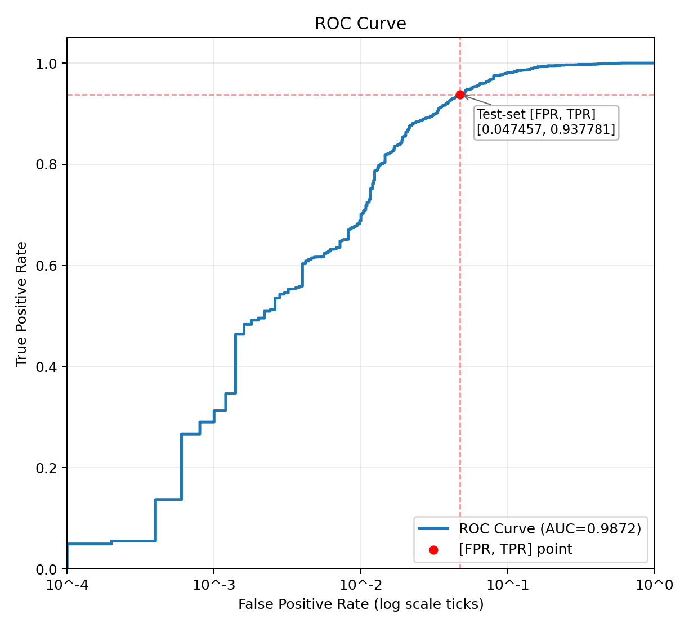

# QUICK REPORT 

## Model Parameters (Current Baseline)

- Quantization: **4-bit**
- Model: **Isolation Forest (`iforest`)**

### Dataset split
- **Train:** 32,000 benign
- **Validation:** 5,000 benign + 400 malware
- **Test:** 5,000 benign + 4,200 malware

## Data journey (training set)
- 32.8 GB (PE files) → 10.6 MB (feature extraction – parquet format)
- 10.6 MB → 8.4 MB (feature cleaning – parquet format)
- 8.4 MB → 1.4 MB (feature optimized – parquet format)
- 1.4 MB → 0.67 MB (4-bit quantization - binary format)

## Test-Set Benchmark (latest reporting run with 4-bit quantization)

- **FPR:** 0.0474 , **TPR:** 0.9378 (after quantization)
- **FPR:** 0.0465 , **TPR:** 0.9404 (before quantization)
- **Model RAM size:** 4,663,482 bytes
- **Model file size:** 8,256,197 bytes
- **Average inference speed / file:** 16.702650 ms
- **Average inference speed / MB:** 5.442300 ms

### Benchmark graphs
- PR curve:

- ROC curve: 

## New improvements to the model

- **Quantization:** reduces model size.
- **Self-retraining:** allows for self-retraining on the device itself.

### Known disadvantage

- The model still emits output messages from the LIEF core inside the feature extractor path. This is a known issue and will be fixed in a later update.

## Documentation Index

- Directory structure overview: [docs/README.md](docs/README.md)
- Development phase guide: [development_phase/docs/DEVELOPMENT_PHASE.md](development_phase/docs/DEVELOPMENT_PHASE.md)
- Embedded phase guide: [embedded_phase/docs/EMBEDDED_PHASE.md](embedded_phase/docs/EMBEDDED_PHASE.md)

## Academic / Research Documents

- Malware validation/test independence assessment: [docs/malware_val_test_independence_assessment.md](docs/malware_val_test_independence_assessment.md)
- Feature-selection pipeline notes: [development_phase/docs/feature_selection_pipeline.md](development_phase/docs/feature_selection_pipeline.md)
