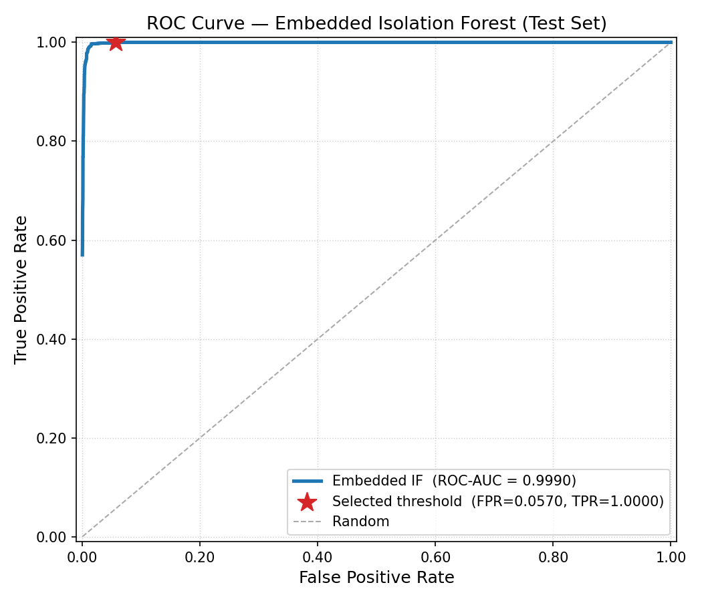

# IsoPE_detect — Results & Engineering Report

This document consolidates the quantitative evaluation results, benchmark measurements, ROC analysis, and engineering status for the **IsoPE_detect** embedded anomaly-detection system.

For architecture, pipeline, and build documentation see [../README.md](../README.md).

---

## Results — Development vs Embedded

After fixing quantization leakage (fit on benign-train once, transform all other splits with the same quantizer), the embedded C++ model reports more conservative metrics.

*Last updated: 2026-02-23 | Source: `embedded_phase/src/model_engine/results/if_evaluation_summary.json`*

| Split | Metric | Development (Python / float) | Embedded (C++ / quantized) | Δ |
|---|---|---|---|---|
| **Validation** | FPR | 0.0370 | 0.0354 | −0.0016 |
| **Validation** | TPR | 0.9208 | 0.8936 | −0.0272 |
| **Validation** | ROC-AUC | 0.9878 | 0.9781 | −0.0097 |
| **Test** | FPR | 0.0465 | 0.0412 | **−0.0053** |
| **Test** | TPR | 0.9404 | 0.8860 | −0.0544 |
| **Test** | ROC-AUC | 0.9885 | 0.9813 | −0.0072 |

Selected decision threshold (embedded): **`0.0393511`**

This result removes the previous optimistic bias caused by split-specific quantizer fitting.

---

## ROC Curve — Embedded IF, Test Set

Generated by `embedded_phase/src/model_engine/plot_roc.py` from per-sample scores saved by `pe_model_engine_cli --save-scores`.

- **ROC-AUC (test): 0.9813**
- Operating point at threshold `0.0393511`: FPR = 0.0412, TPR = 0.8860



> SVG vector version: [`embedded_phase/src/model_engine/results/roc_curve_embedded_test.svg`](../embedded_phase/src/model_engine/results/roc_curve_embedded_test.svg)

### Reproducing the plot

```sh
# Step 1 — generate per-sample scores (after building and running the model engine)
.cmake-debug/embedded_phase/src/model_engine/app/pe_model_engine_cli \
  --config  development_phase/results/iforest_optimized_config.json \
  --quantized-dir  embedded_phase/tools/data_quantization/quantized_datasets \
  --save-scores  embedded_phase/src/model_engine/results/if_test_scores.json

# Step 2 — plot
python3 embedded_phase/src/model_engine/plot_roc.py
# Outputs: results/roc_curve_embedded_test.svg  +  .png
```

---

## Benchmark — 20-File Inference Run (10 Benign + 10 Malware)

*Last updated: 2026-02-23 | Source: `embedded_phase/src/model_engine/results/if_benchmark_report.md`*

Measured per file:
- Feature extraction time from `lief_feature_extractor` (`processing_time_ms`)
- Model inference time: standardisation + quantization + IF scoring
- RAM usage (process RSS in MB)
- Anomaly score and verdict relative to threshold `0.0393511`

| Split | File | File Size (KB) | Extraction (ms) | Inference (ms) | RSS (MB) | Score | Verdict |
|---|---|---:|---:|---:|---:|---:|---|
| benign_test | 000d81f6…ec00.dll | 2956.031 | 20.296 | 0.274 | 15.055 | −0.015 | anomaly |
| benign_test | 000de8f5…d9c2.dll | 60.305 | 2.553 | 0.328 | 15.180 | 0.100 | benign |
| benign_test | 000e0a55…8243.dll | 84.305 | 2.313 | 0.295 | 15.180 | 0.023 | anomaly |
| benign_test | 000f278b…431e.dll | 53.969 | 1.764 | 0.304 | 15.180 | 0.037 | anomaly |
| benign_test | 00167267…1fb2.dll | 8.500 | 0.326 | 0.299 | 15.180 | 0.030 | anomaly |
| benign_test | 001d74d5…f521.dll | 226.500 | 1.339 | 0.379 | 15.180 | 0.060 | benign |
| benign_test | 001dbc4c…d75c.dll | 75.603 | 0.791 | 0.373 | 15.180 | 0.129 | benign |
| benign_test | 002a2f5c…3a58.exe | 21.000 | 0.437 | 0.295 | 15.180 | −0.024 | anomaly |
| benign_test | 0034d97e…8089.exe | 33.828 | 2.455 | 0.322 | 15.180 | 0.074 | benign |
| benign_test | 003df758…e0fe.dll | 19.070 | 1.396 | 0.389 | 15.180 | 0.022 | anomaly |
| malware_test | 0005626a…f6a0.exe | 116.000 | 0.767 | 0.235 | 15.180 | −0.083 | anomaly |
| malware_test | 0009f3b6…552dc.exe | 5258.000 | 33.128 | 0.250 | 15.180 | −0.084 | anomaly |
| malware_test | 0019e0ae…2460.exe | 5266.500 | 35.015 | 0.236 | 15.180 | −0.084 | anomaly |
| malware_test | 0049bd68…8403.exe | 3194.000 | 11.557 | 0.239 | 15.180 | −0.055 | anomaly |
| malware_test | 00654e21…2e6c.exe | 4426.500 | 24.475 | 0.367 | 15.180 | 0.027 | anomaly |
| malware_test | 006622b9…6752.exe | 10240.000 | 38.145 | 0.280 | 15.180 | 0.002 | anomaly |
| malware_test | 00757772…cd6e.exe | 7070.400 | 40.508 | 0.297 | 15.180 | 0.002 | anomaly |
| malware_test | 008902cb…1a1c.exe | 8.000 | 0.301 | 0.253 | 15.180 | −0.049 | anomaly |
| malware_test | 00a16089…3aab.exe | 45289.000 | 176.691 | 0.329 | 15.180 | 0.063 | benign\* |
| malware_test | 00a22dc8…8092.exe | 10025.500 | 35.012 | 0.273 | 15.180 | −0.033 | anomaly |

\* *This 20-sample spot check has FP=6 and FN=1; the full-dataset test FPR/TPR metrics above use all 4948 benign and 4194 malware test samples.*

**Summary statistics (20-file benchmark)**

| Metric | Value |
|---|---|
| Average feature extraction time | **21.463 ms** |
| Average inference time (std + qtz + IF) | **0.301 ms** |
| Peak RSS during benchmark loop | **15.180 MB** |
| Decision threshold | 0.0393511 |

---

## Unit Tests

```
CTest 1/1: pe_model_engine_tests ... Passed  0.00 sec
100% tests passed, 0 tests failed out of 1
```

Tests cover: packed-node field read/write round-trip at all bit widths, and the scoring-order contract (inlier score > outlier score on synthetic data).

---

## Current Status

| Component | Status |
|---|---|
| Development pipeline (feature extraction → selection → optimization) | Complete |
| Handoff artifacts (`iforest_optimized_features.json`, `iforest_optimized_config.json`) | Complete |
| C++ feature extractor (LIEF, compile-time feature binding, resource limits) | Complete |
| Dataset quantization tool (two-tier: single-file module + batch orchestrator) and all quantized dataset artifacts | Complete |
| C++ model engine (quantized IF, threshold selection, metrics, CLI) | Complete |
| Unit tests | Complete |
| Dev vs embedded parity comparison | Complete |
| Per-sample score export (`--save-scores`) + ROC plot (`plot_roc.py`) | Complete |

---

## Build Quick-Reference

```sh
# Development pipeline
cd development_phase/src && python3 model_optimization.py

# Dataset quantization (build single-file module first, then run batch orchestrator)
cd tools/data_quantization && make build && cd ../..
cd embedded_phase/tools/data_quantization && ./quantize_dataset.sh

# Feature extractor
cd embedded_phase/src/feature_extractor && ./build.sh

# Model engine
cmake -B .cmake-debug -DCMAKE_BUILD_TYPE=Debug .
cmake --build .cmake-debug --target pe_model_engine_cli pe_model_engine_tests
ctest --test-dir .cmake-debug

# Evaluation + score export
.cmake-debug/embedded_phase/src/model_engine/app/pe_model_engine_cli \
  --config  development_phase/results/iforest_optimized_config.json \
  --quantized-dir  embedded_phase/tools/data_quantization/quantized_datasets \
  --output  embedded_phase/src/model_engine/results/if_evaluation_summary.json \
  --save-scores  embedded_phase/src/model_engine/results/if_test_scores.json

# ROC plot
python3 embedded_phase/src/model_engine/plot_roc.py
```

---

## Next Steps

1. **End-to-end CLI integration** — wire the feature extractor and model engine CLIs into a single binary that accepts a PE path and emits a verdict.
2. **Numerical parity harness** — dump raw float feature vectors from the extractor and compare per-sample Python vs C++ anomaly scores.
3. **Deployment tuning** — profile compile-time resource-limit macros against the target device's RAM/CPU budget.
4. **Incremental retraining** — define a procedure to re-run the development pipeline with fresh benign samples and regenerate both handoff artifacts.
5. **Future work** — explore alternate anomaly detectors; consider on-device threshold update without full model rebuild.
