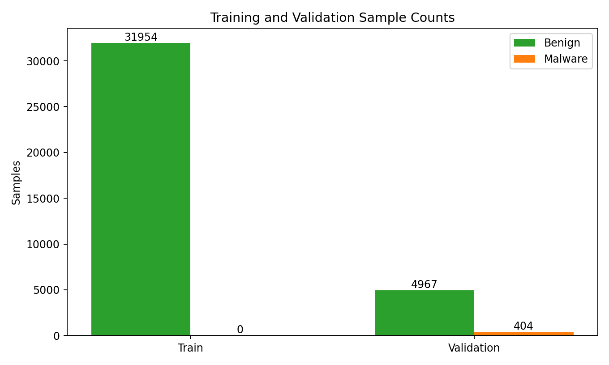

# Raw-PE Evaluation Report (Quantization 4-bit)

Generated at: 2026-02-27 01:34:33

## Metadata

- Repo root: /home/viettran/Documents/visual_code/EDR_AGENT/.
- Model name: iforest
- Threshold: -0.541805
- Quantization bits: 4

## Sample Counts

- Train benign: 31954
- Train malware: 0
- Validation benign: 4967
- Validation malware: 404
- Validation total: 5371
- Test benign: 5000
- Test malware: 4227
- Test total: 9227

## Model Parameters and Footprint

- Model RAM size (bytes): 37167736
- Model file size (bytes): 8256197
- Model file path: /home/viettran/Documents/visual_code/EDR_AGENT/./embedded_phase/core/models/isolation_forest/resources/iforest_iforest.bin

## Metrics

- FPR: 0.045054
- TPR: 0.937781
- ROC-AUC: 0.987847
- AP: 0.984135
- PRC-AUC: 0.984135

## Performance

- Benign total inference time (sec): 24.251003
- Malware total inference time (sec): 132.579511
- Total inference time (sec): 156.830514
- Average inference speed per file (ms): 16.996913
- Average inference speed per MB (ms): 5.538181

## Charts

### Training/Validation Sample Counts

### Precision-Recall Curve

### ROC Curve (log-spaced FPR ticks)

